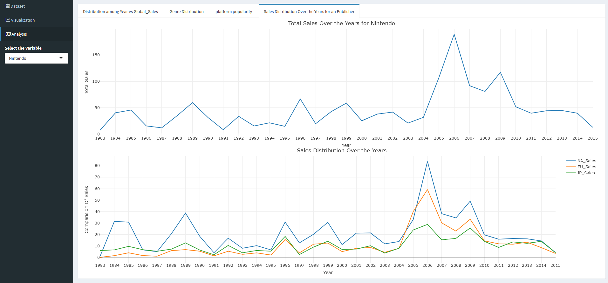

# R Dashboard

This repository contains a dashboard application built using R. It provides a video game sales dashboard involve ensuring data accuracy by integrating reliable sources, designing a visually clear interface with intuitive charts and graphs, incorporating comprehensive metrics allowing customization for user preferences, monitoring dashboard performance and informed decision-making..

## To run this R-shiny application

Click on the `Run App` button typically found in the top-right corner of the script editor pane in RStudio, or run the command `shiny::runApp()` in the R console.

## Table of Contents

- [Getting Started](#getting-started)
- [Features of R](#features-of-r)
- [Features of Shiny](#features-of-shiny)
- [Rstudio](#rstudio)
- [Attachments](#attachments)

## Getting Started

To get a local copy up and running, follow these simple steps:

### Prerequisites

Make sure you have the following installed:

- R
- R Studio
- shiny

## Features of R

> **Statistical Power:** R is a statistical computing language known for its extensive built-in functions and packages for advanced statistical analysis.

> **Visualization:** It offers robust tools for creating high-quality graphs and visualizations, essential for data exploration and presentation.

> **Data Manipulation:** R provides efficient data manipulation capabilities through libraries like dplyr and tidyr, enabling easy cleaning, transformation, and aggregation of data.

> **Community and Packages:** Supported by a vibrant community, R benefits from a vast repository of user-contributed packages that extend its functionality across various domains.

## Features of Shiny

> **Interactive Web Applications:** R Shiny enables the creation of interactive web applications directly from R scripts, allowing for dynamic user interfaces and real-time data updates.

> **Reactive Programming:** It utilizes reactive programming principles where changes in inputs automatically update outputs, enhancing interactivity and responsiveness.

> **Customizable Layouts:** Developers can design flexible and visually appealing layouts using Shiny's layout functions and CSS, ensuring tailored user experiences.

> **Integration with R:** Built on R, Shiny seamlessly integrates with R's statistical and graphical capabilities, enabling advanced data analysis and visualization within web apps.

## RStudio

- RStudio is an integrated development environment (IDE) for R, featuring a script editor with syntax highlighting, an interactive R console, and tools for managing R packages. It supports interactive plotting, project management with Git integration, and R Markdown for reproducible reporting. RStudio simplifies R programming by providing a cohesive environment for writing, debugging, and sharing R code, making it a preferred choice for data analysis and statistical computing tasks.

## Attachments:

For more visit [result](/results/) in this repository.
